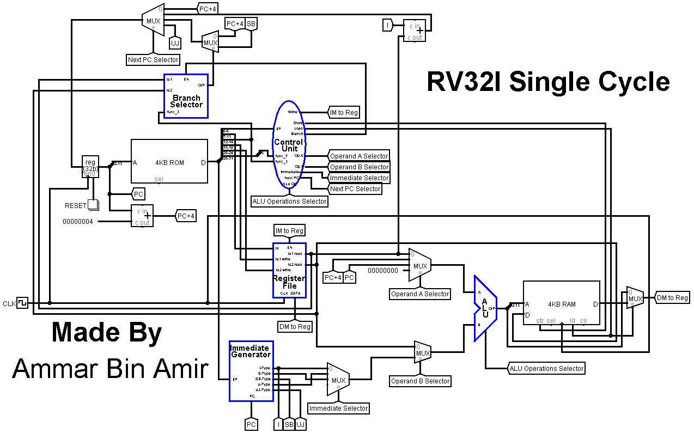

# RV32I Single Cycle CPU

## **Description**

This repository is based on RV32I Single Cycle Processor designed on Logisim Simulator which elaborates the RISC-V Data Path of each supported instruction about how they are executed from ROM to RAM.

## **Pre-requisites**

- [Logisim](http://www.cburch.com/logisim/download.html) Simulator
- [Venus](https://venus.cs61c.org/) Simulator

## **Instructor**

- [Zeeshan Rafique](https://github.com/zeeshanrafique23)
- [Sajjad Ahmed](https://github.com/sajjadahmed677)

## **Components**

- Program Counter
- ROM
- Control Unit
	- Type Decoder
	- Control Decoder
- Register File
- Immediate Selector
- Branch Selector
- ALU
- RAM

## **Circuit Development**

The initial step before coming to the designing of the circuit, the basic knowledge about the RV32I Instructions Set Architecture (ISA) must be under practice on online Venus Simulator that basically accepts codes of assembly language for RISC-V. The next step is to implement the codes into circuit so that each instruction should be executed well from ROM to RAM. Both are of 32-bit having address width of 12 bit. Before the ROM, a program counter is connected that tells which next address/instruction is to be executed. This 32-bit instruction is divided into core instruction format from which few parts are transmitted into control unit. The control unit is made up of two sub-components that are; type decoder which separated each instruction respective of its type whereas the other component i.e., control decoder controls all the sub-functions are to be executed by other components. The destination register and both the source registers are transmitted into register file. ALU that can be considered as one of the important systems of the entire circuit accepts three inputs: ALU operations selector from control unit, operand A and operand B that produces the outcome after addition. This produced outcome is then further proceeded towards ROM or towards register file regarding the instruction. There are few differences between types, such as; few of them accepts immediate while few of them possesses jump and link command. These types of cases are supported by components of Immediate Selector and Branch Selector respectively. In the designing, the last step is to provide the next pc address to program counter as discussed above about its job. This is how the cycle is completed.

## **Instructions Supported**

1)	add
2)	sub
3)	and
4)	or
5)	xor
6)	sll
7)	srl
8)	slt
9)	sltu
10)	sra
11)	addi
12)	andi
13)	ori
14)	xori
15)	slli
16)	srli
17)	slti
18)	sltiu
19)	srai
20)	jalr
21)	lw
22)	sw
23)	beq
24)	bne
25)	blt
26)	bge
27)	bltu
28)	bgeu
29)	auipc
30)	lui
31)	jal

## **Program Execution**

To check whether the circuit is working or not! First of all, a few codes of line (instructions) are typed on online Venus simulator. After confirmation, the Dump option of the simulator is clicked that copies the hex address of each instruction. Then, open a notepad file and type a header statement v2.0 raw at the top of the file. Now copy the hex address and remove 0x0 from each address and save the file in abc.mem format which would be enabled by selecting All Files option. The last step is to upload the code into ROM i.e., load data into ROM. This is performed by right clicking on the ROM, in which an option Load Image is selected that allows us to choose the file to be loaded.

## **Sample Program**

This circuit already possesses data in the ROM.

This program stores number '1' at zeroth address in data memory i.e., RAM, then according to the loop, the value is updated by an increment of one that means each time the next value is rewrite upon the previous value with addition of one on the same address.

_(This is the code of instruction.)_

```
addi x5,x0,0	# Initialization
loop:
addi x5,x5,1	# Increment
sw x5,0x0(x0)
lw x6,0x0(x0)
jal ra,loop	# Iteration
```

_(This is the hex code of above program.)_

```
v2.0 raw
00000293
00128293
00502023
00002303
FF5FF0EF
```

## **Circuit Snapshot**



>_The best among you are those who bring greatest benefits to many other._
